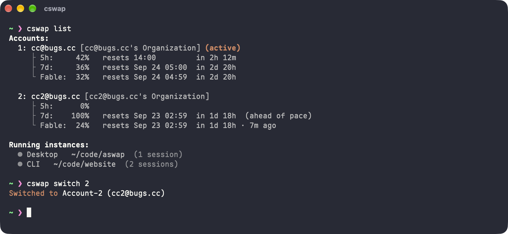
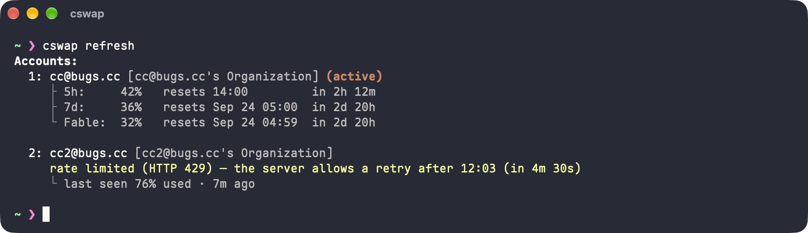
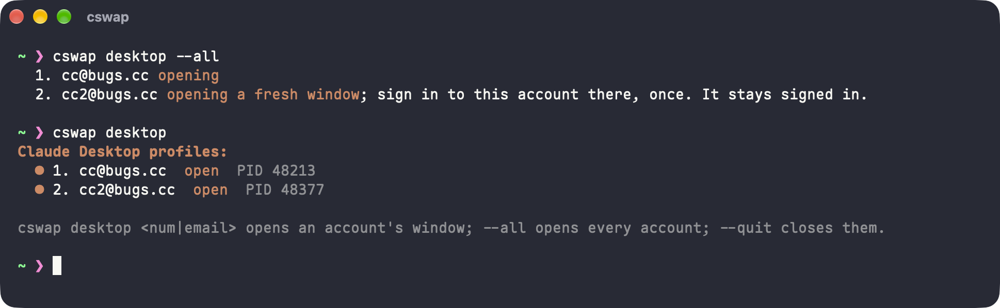

<div align="center">

# aswap

[English](../../README.md) | [简体中文](README.zh-CN.md) | [繁體中文](README.zh-TW.md) | [日本語](README.ja.md) | [한국어](README.ko.md) | [Русский](README.ru.md) | Français | [Español](README.es.md)

Changement de compte pour Claude Code : [claude-swap](https://github.com/realiti4/claude-swap) (`cswap`) avec un ensemble de correctifs maintenus.



</div>

`cswap` bascule entre plusieurs comptes Claude, suit l'utilisation de chacun et peut vous passer sur le compte qui a le plus de quota restant. aswap est le même outil, construit à partir des sources upstream non modifiées plus une petite série de patches pour les bugs qu'upstream n'a pas encore corrigés. Vous lancez toujours `cswap`.

## Le nom

aswap est l'abréviation d'**account swap**, le changement de compte, c'est ce que fait l'outil. À côté de `cswap`, le `a` est aussi ce que ce projet ajoute : aswap, c'est cswap plus une série de patches. À mesure que Claude Code devient un environnement d'exécution d'agents, ce même `a` convient aussi aux comptes d'IA et d'agents qui l'accompagnent.

## Installation

```bash
uv tool install aswap  # ou : pipx install aswap
aswap --version
```

`aswap` accepte toutes les commandes de `cswap`. Il s'installe à côté d'un `cswap` upstream sans le modifier. Pour lancer aswap aussi sous le nom `cswap` :

```bash
aswap link  # crée un lanceur cswap à côté d'aswap ; aswap unlink le retire
```

`aswap link` ne remplace qu'un `cswap` qu'il a lui-même créé. Désinstallez d'abord l'upstream (`uv tool uninstall claude-swap`) ou passez `--force`.

## Mise à jour

```bash
aswap upgrade  # uv tool upgrade aswap ou pipx upgrade aswap, selon l'installation
```

La compilation depuis les sources et le remplacement du `cswap` PyPI déjà installé par la version patchée sont décrits dans [CONTRIBUTING.md](../../CONTRIBUTING.md).

## Ce que corrigent les patches

| patch                                                                                                                                              | problème                                                                                                                                                                                                                                                                                                                                                                                                                                                                                                                                                                                                                                                                                                                                 |
| -------------------------------------------------------------------------------------------------------------------------------------------------- | ---------------------------------------------------------------------------------------------------------------------------------------------------------------------------------------------------------------------------------------------------------------------------------------------------------------------------------------------------------------------------------------------------------------------------------------------------------------------------------------------------------------------------------------------------------------------------------------------------------------------------------------------------------------------------------------------------------------------------------------- |
| [Suivre le vrai propriétaire de l'identifiant actif](../../patches/fix_follow_the_live_credentials_owner_when_the_config_names_another_slot.patch) | Un `~/.claude.json` périmé peut encore nommer le compte B alors que le trousseau contient déjà le jeton du compte A. L'upstream marque alors A « re-login needed » et ne rafraîchit plus B. Le patch suit le vrai propriétaire et mémorise la réponse d'une exécution à l'autre.                                                                                                                                                                                                                                                                                                                                                                                                                                                         |
| [Suivre la distribution installée](../../patches/feat_report_check_and_upgrade_the_distribution_this_install_came_from.patch)                      | La version, la vérification de mise à jour et `upgrade` codent en dur le nom `claude-swap`, donc ils cassent quand l'installation s'appelle `aswap`. Le patch suit la distribution qui fournit réellement le code.                                                                                                                                                                                                                                                                                                                                                                                                                                                                                                                       |
| [Rafraîchir l'usage à la demande](../../patches/feat_add_a_refresh_command_that_fetches_usage_now_one_account_at_a_time.patch)                     | L'upstream ne récupère l'usage que selon son propre calendrier. Tant que le serve TTL, le plan de polling et le backoff d'échec n'autorisent pas une nouvelle requête, chaque écran affiche la valeur en cache, et l'heure de retry du serveur n'est jamais montrée. `cswap refresh [compte ...]` interroge tout de suite, chaque compte indépendamment, et indique quand un compte limité peut réessayer.                                                                                                                                                                                                                                                                                                                               |
| [Fusion d'historique sans perte](../../patches/fix_set_aside_a_differing_history_file_instead_of_dropping_the_profiles_copy.patch)                 | Quand `cswap run` fusionne l'historique propre d'un profil dans `~/.claude`, l'upstream traite tout fichier homonyme comme un doublon et supprime la copie du profil sans en lire le contenu. Une session poursuivie après l'arrêt du partage, ou le `memory/MEMORY.md` d'un projet, disparaît sans avertissement. Le patch n'écarte une copie que si les deux fichiers sont identiques et met la copie différente de côté sous `history-conflicts/`.                                                                                                                                                                                                                                                                                    |
| [Un seul historique de conversations](../../patches/feat_share_one_conversation_history_across_accounts_by_default.patch)                          | Chaque compte garde son propre `projects/` sauf si chaque lancement porte `--share-history`. Quand le compte est le login par défaut, `cswap run` ignore le profil entièrement. Les sessions d'un compte se retrouvent à deux endroits, et `claude --resume` ne retrouve plus une conversation après un changement de compte par défaut (upstream #239). Le patch fait du partage la valeur par défaut, la conserve dans le réglage `session.shareHistory`, et rapatrie l'historique du profil dans `~/.claude` même sur le chemin du login par défaut.                                                                                                                                                                                  |
| [Ouvrir Claude Desktop par compte](../../patches/feat_open_claude_desktop_as_a_stored_account_one_window_per_account.patch)                        | Claude Desktop ne garde qu'un login par profil : pour un second compte il faut se déconnecter et se reconnecter à chaque fois. Le patch donne à chaque compte enregistré un profil desktop permanent et lance l'application dessus avec `--user-data-dir`, comme le fait [guise](https://github.com/siddhjagani/guise) : `cswap desktop 2` ouvre le compte 2 dans sa propre fenêtre, connecté une fois pour toutes, pendant que les fenêtres des autres comptes restent ouvertes à côté. Les sessions locales de l'onglet Code sont partagées avec le profil d'origine, donc une fenêtre ouverte ainsi liste les mêmes sessions.                                                                                                         |
| [Ouvrir Chrome par compte pour Claude in Chrome](../../patches/feat_open_chrome_as_a_stored_account_so_claude_in_chrome_follows_it.patch)          | `cswap switch` change le compte de Claude Code, mais l'extension Claude in Chrome continue d'agir comme le compte connecté à claude.ai dans le navigateur, un cookie qui est un identifiant distinct de celui que cswap stocke (upstream #256). Remplacer ce cookie demanderait de déchiffrer le stockage de Chrome et de réécrire l'état d'une autre extension. Le patch donne à chaque compte enregistré un profil Chrome permanent et lance le navigateur dessus avec `--user-data-dir` : `cswap chrome 2` ouvre le compte 2 dans son propre navigateur, où l'extension est installée et connectée une fois pour toutes ; un compte déjà ouvert est ramené au premier plan. `chrome.appPath` permet de viser Edge, Brave ou Chromium. |

Chaque patch est un commit. Le message du commit explique le problème upstream. La liste complète est dans [patches/.patches](../../patches/.patches).

`cswap refresh` récupère l'utilisation immédiatement, compte par compte, et indique quand un compte limité pourra réessayer :



`cswap desktop --all` ouvre une fenêtre Claude Desktop par compte enregistré, chacune connectée séparément :



## Comment c'est construit

Le projet épingle un commit upstream dans `upstream.json`, le clone tel quel dans `cswap/`, et place chaque modification dans `patches/` sous forme de patch `git am` ordinaire. Les patches s'appliquent dans l'ordre de `patches/.patches`. C'est [l'organisation qu'Electron utilise pour ses patches Node et Chromium](https://github.com/electron/electron/tree/main/patches) : le delta reste petit et lisible, et passer à un upstream plus récent est un rebase de la série. Les détails, les commandes et le workflow des patches sont dans [CONTRIBUTING.md](../../CONTRIBUTING.md).

## Licence

MIT, comme claude-swap. Voir [LICENSE](../../LICENSE).
