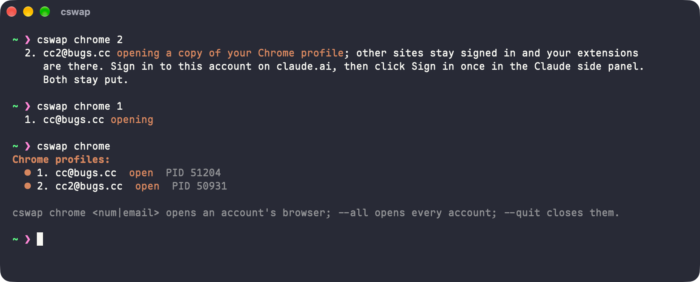

<div align="center">

# aswap

[English](../../README.md) | [简体中文](README.zh-CN.md) | [繁體中文](README.zh-TW.md) | [日本語](README.ja.md) | 한국어 | [Русский](README.ru.md) | [Français](README.fr.md) | [Español](README.es.md)

Claude Code용 계정 전환 도구: [claude-swap](https://github.com/realiti4/claude-swap) (`cswap`)에 지속적으로 관리되는 수정을 더한 것입니다.


</div>

`cswap`은 여러 Claude 계정 사이를 전환하고, 각 계정의 사용량을 추적하며, 남은 사용량이 가장 많은 계정으로 옮겨 줍니다. aswap은 같은 도구입니다. 수정하지 않은 업스트림 소스로 빌드하고, 업스트림이 아직 고치지 않은 문제에 대한 작은 패치를 얹었습니다. 실행하는 명령은 그대로 `cswap`입니다.

## 이름

aswap은 **account swap** (계정 전환)의 줄임말이며, 이 도구가 하는 일 그 자체입니다. `cswap` 옆에 두면 `a`는 이 프로젝트가 더하는 것이기도 합니다. aswap은 cswap에 패치를 더한 것입니다. Claude Code가 범용 에이전트 런타임으로 자라날수록, 그 `a`는 함께 따라오는 AI와 에이전트 계정에도 맞습니다.

## 설치

```bash
uv tool install aswap  # 또는: pipx install aswap
aswap --version
```

`aswap`은 `cswap`의 모든 사용법을 받습니다. 업스트림 `cswap` 옆에 설치되며 그것을 건드리지 않습니다. `cswap`이라는 이름으로도 aswap을 실행하려면:

```bash
aswap link  # aswap 옆에 cswap 런처를 만듭니다. aswap unlink로 제거
```

`aswap link`가 교체하는 것은 자신이 만든 `cswap`뿐입니다. 업스트림을 먼저 제거하거나 (`uv tool uninstall claude-swap`) `--force`를 붙이세요.

## 업그레이드

```bash
aswap upgrade  # 설치 방식에 따라 uv tool upgrade aswap 또는 pipx upgrade aswap
```

소스에서 빌드하는 방법과, 설치된 PyPI `cswap`을 패치된 빌드로 대체하는 방법은 [CONTRIBUTING.md](../../CONTRIBUTING.md)에 있습니다.

## 패치가 고치는 것

| 패치                                                                                                                                    | 문제                                                                                                                                                                                                                                                                                                                                                                                                                                                                                                                                                                                                                                                                                                                                                                                                                                                                                                                                                                                   |
| --------------------------------------------------------------------------------------------------------------------------------------- | -------------------------------------------------------------------------------------------------------------------------------------------------------------------------------------------------------------------------------------------------------------------------------------------------------------------------------------------------------------------------------------------------------------------------------------------------------------------------------------------------------------------------------------------------------------------------------------------------------------------------------------------------------------------------------------------------------------------------------------------------------------------------------------------------------------------------------------------------------------------------------------------------------------------------------------------------------------------------------------- |
| [라이브 자격 증명의 실제 소유자를 따르기](../../patches/fix_follow_the_live_credentials_owner_when_the_config_names_another_slot.patch) | 오래된 `~/.claude.json`이 계정 B를 가리키는데 키체인에는 계정 A의 토큰이 남아 있을 수 있습니다. 업스트림은 A를 "재로그인 필요"로 표시하고 B도 갱신하지 않습니다. 이 패치는 자격 증명의 실제 소유자를 따르고 그 답을 실행 간에 기억합니다.                                                                                                                                                                                                                                                                                                                                                                                                                                                                                                                                                                                                                                                                                                                                              |
| [설치된 배포판을 따르기](../../patches/feat_report_check_and_upgrade_the_distribution_this_install_came_from.patch)                     | 버전, 업데이트 확인, `upgrade`가 `claude-swap`이라는 이름을 고정해 두어 `aswap`으로 설치하면 깨집니다. 이 패치는 실제로 코드를 제공하는 배포판을 따릅니다.                                                                                                                                                                                                                                                                                                                                                                                                                                                                                                                                                                                                                                                                                                                                                                                                                             |
| [사용량 즉시 새로 고침](../../patches/feat_add_a_refresh_command_that_fetches_usage_now_one_account_at_a_time.patch)                    | 업스트림은 자체 일정으로만 사용량을 가져옵니다. serve TTL, 폴링 계획, 실패 백오프가 모두 다음 요청을 허용할 때까지 모든 화면은 캐시된 값을 보여 주고, 서버가 재시도를 허용하는 시각은 표시하지 않습니다. `cswap refresh [계정 ...]`은 지금 바로 가져오고, 계정마다 독립적으로 동작하며, 제한된 계정이 언제 재시도할 수 있는지 알려 줍니다.                                                                                                                                                                                                                                                                                                                                                                                                                                                                                                                                                                                                                                             |
| [기록 병합 시 파일을 잃지 않음](../../patches/fix_set_aside_a_differing_history_file_instead_of_dropping_the_profiles_copy.patch)       | `cswap run`이 프로필 자체 기록을 `~/.claude`에 병합할 때 업스트림은 같은 이름의 파일을 모두 중복으로 보고 내용을 확인하지 않은 채 프로필 쪽을 삭제합니다. 공유를 끈 뒤 이어 간 세션이나 프로젝트의 `memory/MEMORY.md`가 경고 없이 사라집니다. 패치는 두 파일이 완전히 같을 때만 버리고, 다른 쪽은 `history-conflicts/` 아래에 보관합니다.                                                                                                                                                                                                                                                                                                                                                                                                                                                                                                                                                                                                                                              |
| [대화 기록을 하나로 공유](../../patches/feat_share_one_conversation_history_across_accounts_by_default.patch)                           | 매번 `--share-history`를 붙이지 않으면 계정마다 별도의 `projects/`를 가지며, 그 계정이 기본 로그인일 때 `cswap run`은 프로필을 아예 건너뜁니다. 한 계정의 세션이 두 곳에 흩어지고, 기본 계정을 바꾼 뒤에는 `claude --resume`이 대화를 찾지 못합니다 (업스트림 #239). 패치는 공유를 기본값으로 만들어 `session.shareHistory` 설정에 저장하고, 기본 로그인 경로에서도 프로필 기록을 `~/.claude`에 합칩니다.                                                                                                                                                                                                                                                                                                                                                                                                                                                                                                                                                                              |
| [계정별로 Claude Desktop 열기](../../patches/feat_open_claude_desktop_as_a_stored_account_one_window_per_account.patch)                 | Claude Desktop은 프로필당 로그인 하나만 유지하므로, 다른 계정을 쓰려면 매번 로그아웃했다가 다시 로그인해야 합니다. 이 패치는 저장된 각 계정에 영구적인 데스크톱 프로필을 주고 [guise](https://github.com/siddhjagani/guise)처럼 `--user-data-dir`로 앱을 실행합니다. `cswap desktop 2`는 계정 2를 전용 창에서 열고, 한 번 로그인하면 계속 유지되며, 다른 계정의 창도 나란히 열어 둘 수 있습니다. Code 탭의 로컬 세션은 기본 프로필과 공유되므로, 이렇게 연 창에도 같은 세션이 보입니다.                                                                                                                                                                                                                                                                                                                                                                                                                                                                                                |
| [계정별로 Chrome 열기 (Claude in Chrome)](../../patches/feat_open_chrome_as_a_stored_account_so_claude_in_chrome_follows_it.patch)      | `cswap switch`는 Claude Code를 바꾸지만, Claude in Chrome 확장은 브라우저에서 claude.ai에 로그인된 계정으로 계속 동작합니다. 그것은 cswap이 저장하는 자격 증명과는 다른 cookie입니다 (업스트림 #256). 이 cookie를 바꾸려면 Chrome 저장소를 복호화하고 다른 확장의 상태를 고쳐 써야 합니다. 이 패치는 저장된 각 계정에 영구적인 Chrome 프로필을 주고 `--user-data-dir`로 브라우저를 실행합니다. `cswap chrome 2`는 계정 2를 전용 브라우저에서 엽니다. 기본 Chrome 프로필에서 claude.ai cookie만 뺀 복사본이라 다른 사이트는 로그인이 유지되고 확장도 그대로 따라오며, 거기서 한 번 로그인하면 계정과 확장 모두 그대로 유지됩니다. 각 프로필은 계정 이름과 고유한 창 색상을 가지며, 이미 열린 계정은 그 브라우저를 앞으로 가져오고, 그 브라우저를 닫은 뒤 `cswap chrome --sync 2`로 기본 프로필에서 다시 동기화하되 로그인은 유지합니다. `chrome.followSwitch`를 켜면 `cswap switch`가 해당 브라우저도 앞으로 가져오고, `chrome.appPath`로 Edge, Brave, Chromium을 가리킬 수도 있습니다. |

각 패치는 커밋 하나입니다. 커밋 메시지가 업스트림 문제를 설명합니다. 전체 목록은 [patches/.patches](../../patches/.patches)에 있습니다.

`cswap refresh`는 지금 바로 계정별로 사용량을 가져오고, 속도 제한에 걸린 계정이 언제 다시 시도할 수 있는지 보여 줍니다:


`cswap desktop --all`은 저장된 계정마다 Claude Desktop 창을 하나씩 열고, 각 창은 따로 로그인된 상태를 유지합니다:


`cswap chrome 2`는 기본 Chrome 프로필의 복사본에서 계정 2를 열어, 그곳의 Claude in Chrome 확장은 계정 2로 동작하고 기본 브라우저는 원래 로그인을 유지합니다:



## 만드는 방식

업스트림 커밋 하나를 `upstream.json`에 고정하고, 그대로 `cswap/`에 clone합니다. 모든 변경은 일반적인 `git am` 패치로 `patches/`에 두며 `patches/.patches`에 나열된 순서대로 적용합니다. 이것은 [Electron이 Node와 Chromium 패치를 관리하는 방식](https://github.com/electron/electron/tree/main/patches)과 같습니다. 차이는 작고 읽기 쉽게 유지되며, 업스트림 업데이트는 패치 시리즈의 rebase가 됩니다. 세부 사항, 명령, 패치 워크플로는 [CONTRIBUTING.md](../../CONTRIBUTING.md)에 있습니다.

## 라이선스

claude-swap과 같은 MIT. [LICENSE](../../LICENSE) 참조.
